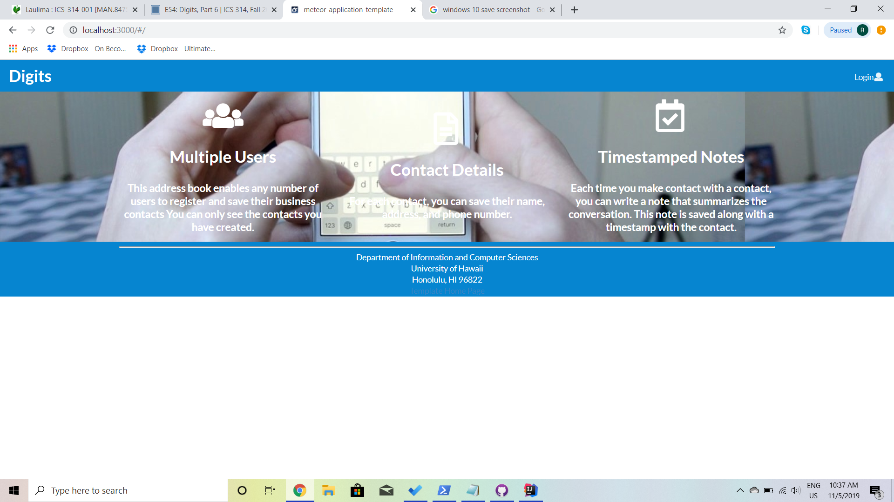
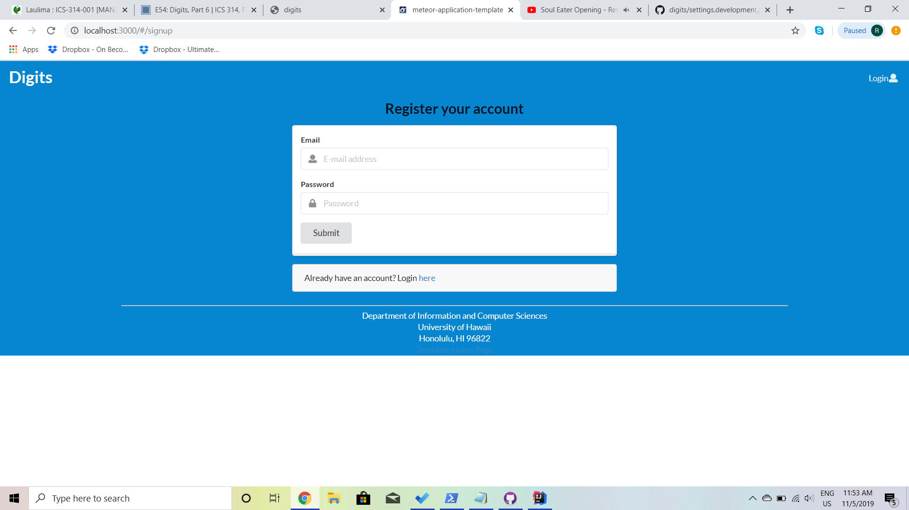
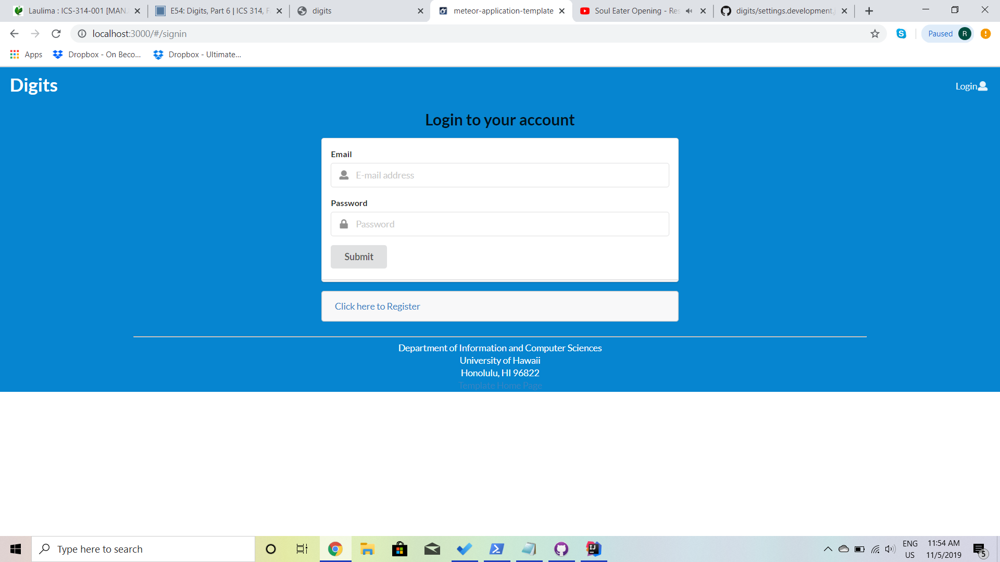
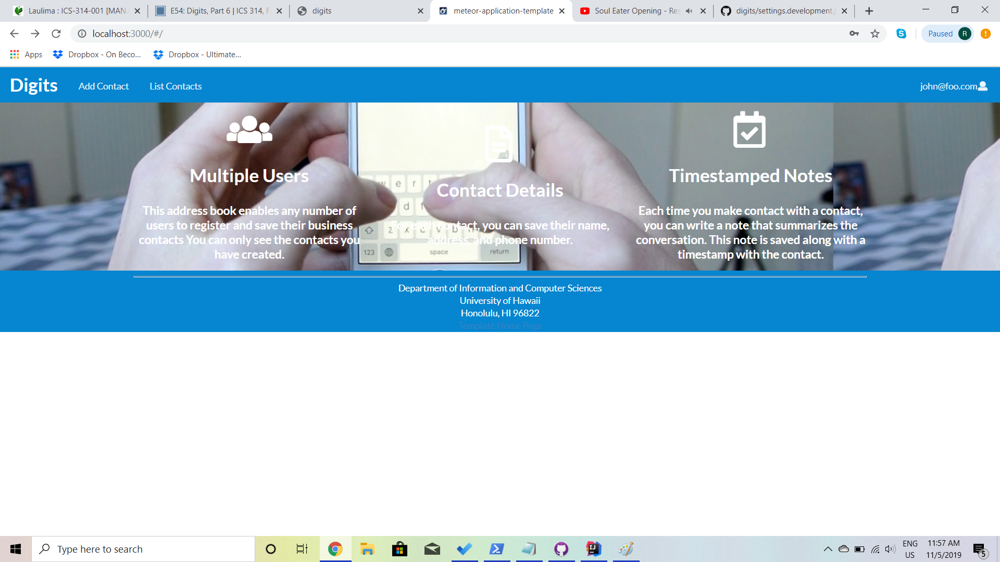
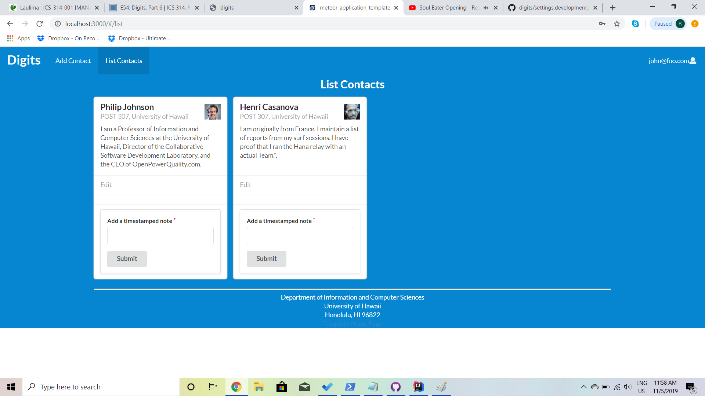
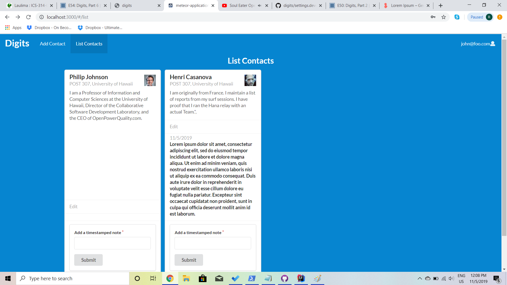
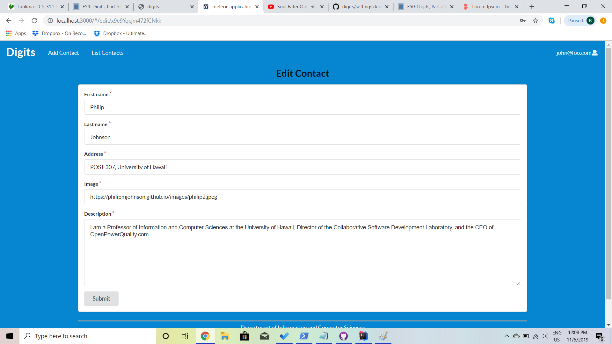
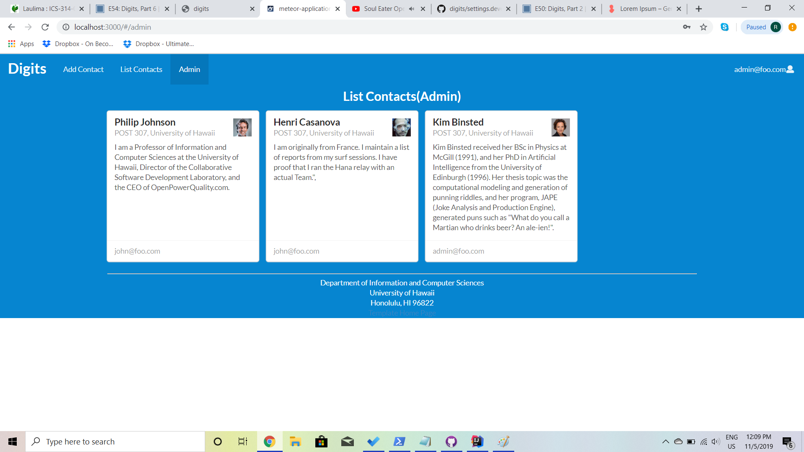

<html lang="en-US">
<head>
</head>
<body>

<h1>Digits</h1>

Digits is an application that allows users to:

<ul>
    <li>Register an account</li>
    <li>Create and manage a set of contacts</li>
    <li>Add a set of timestamped notes regarding their interactions with each contact</li>
</ul>

<h3>Installation</h3>

First, <a href="https://www.meteor.com/install">install Meteor</a>.

Second, <a href="https://github.com/RyutoKitagawa/digits">download a copy of Digits</a>. Note that Digits is a private repo and so you will need to request permission from the author to gain access to the repo.

Third, cd into the app directory install the required libraries with:

    $meteor run start
    

The first time you run the app, it will create some default users and data. Here is the output:

    meteor npm run start
    > meteor-application-template-react@ start /Users/philipjohnson/github/philipmjohnson/digits/app
    > meteor --no-release-check --settings ../config/settings.development.json
    [[[[[ ~/github/philipmjohnson/digits/app ]]]]]             
    => Started proxy.                             
    => Started MongoDB.                           
    I20180305-18:06:02.764(-10)? Creating the default user(s)
    I20180305-18:06:02.803(-10)?   Creating user admin@foo.com.
    I20180305-18:06:02.803(-10)?   Creating user john@foo.com.
    I20180305-18:06:02.804(-10)? Creating default contacts.
    I20180305-18:06:02.804(-10)?   Adding: Johnson (john@foo.com)
    I20180305-18:06:02.804(-10)?   Adding: Casanova (john@foo.com)
    I20180305-18:06:02.804(-10)?   Adding: Binsted (admin@foo.com)
    => Started your app.
    => App running at: http://localhost:3000/
    W20180305-18:06:02.805(-10)? (STDERR) Note: you are using a pure-JavaScript implementation of bcrypt.
    W20180305-18:06:02.805(-10)? (STDERR) While this implementation will work correctly, it is known to be
    W20180305-18:06:02.806(-10)? (STDERR) approximately three times slower than the native implementation.
    W20180305-18:06:02.806(-10)? (STDERR) In order to use the native implementation instead, run
    W20180305-18:06:02.806(-10)? (STDERR) 
    W20180305-18:06:02.806(-10)? (STDERR)   meteor npm install --save bcrypt
    W20180305-18:06:02.806(-10)? (STDERR) 
    W20180305-18:06:02.806(-10)? (STDERR) in the root directory of your application.

<b>Note regarding bcrypt warning.</b> You will also get the following message when you run this application:
                                     

    Note: you are using a pure-JavaScript implementation of bcrypt.
    While this implementation will work correctly, it is known to be
    approximately three times slower than the native implementation.
    In order to use the native implementation instead, run
    
      meteor npm install --save bcrypt
    
    in the root directory of your application.

On some operating systems (particularly Windows), installing bcrypt is much more difficult than implied by the above message. Bcrypt is only used in Meteor for password checking, so the performance implications are negligible until your site has very high traffic. You can safely ignore this warning without any problems during initial stages of development.

If all goes well, the template application will appear at <a href="http://localhost:3000">http://localhost:3000</a>. You can login using the credentials in <a href="https://github.com/RyutoKitagawa/digits/blob/master/config/settings.development.json">settings.development.json</a>, or else register a new account.

Lastly, you can run ESLint over the code in the imports/ directory with:

    $meteor npm run lint
    

<h3>User Interface Walkthrough</h3>
<b>Landing Page</b>

When you first bring up the application, you will see the landing page that provides a brief introduction to the capabilities of Digits:

<b>Register</b>

If you do not yet have an account on the system, you can register by clicking on “Login”, then “Sign Up”:

<b>Sign in</b>

Click on the Login link, then click on the Signin link to bring up the Sign In page which allows you to login:

<b>User home page</b>

After successfully logging in, the system takes you to your home page. It is just like the landing page, but the NavBar contains links to list contact and add new contacts:

<b>List Contacts</b>

Clicking on the List Contacts link brings up a page that lists all of the contacts associated with the logged in user:

This page also allows the user to add timestamped “notes” detailing interactions they’ve had with the Contact. For example:

<b>Edit Contacts</b>

From the List Contacts page, the user can click the “Edit” link associated with any Contact to bring up a page that allows that Contact information to be edited:

<b>Admin mode</b>

It is possible to designate one or more users as “Admins” through the settings file. When a user has the Admin role, they get access to a special NavBar link that retrieves a page listing all Contacts associated with all users:

</body>
